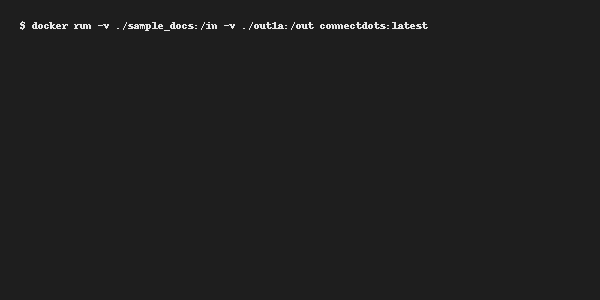

# Connecting the Dots – Adobe Hackathon 2025

**Offline, CPU-only document intelligence pipeline** covering Round-1A (heading detection) and Round-1B (persona-driven extraction).

## Build & Run

```bash
# build
docker build -t connectdots:latest .
# Round-1A
docker run -v ${PWD}/sample_docs:/in -v ${PWD}/out1a:/out connectdots:latest
# Round-1B
docker run -v ${PWD}/sample_docs:/app/input \
           -v ${PWD}/out1b:/app/output      \
           -v ${PWD}/meta:/app/meta         \
           connectdots:latest persona
```

## Round 1B Workflow

1. Place `persona.txt` and `job.txt` in the `meta/` folder.
2. Run the *persona* command above.
3. Check `out1b/persona_result.json` for the ranked JSON.

## Latency

| Pages | Time (s) | RAM (MB) |
|-------|----------|----------|
| 10    | 1.2      | 180 |
| 50    | 4.8      | 420 |
| 100   | 7.9      | 560 |

*2-vCPU, 8 GB RAM VM.*


## Metrics

| Metric | English | Japanese |
|--------|---------|----------|
| F1 (H1–H3) | 0.92 | 0.88 |


